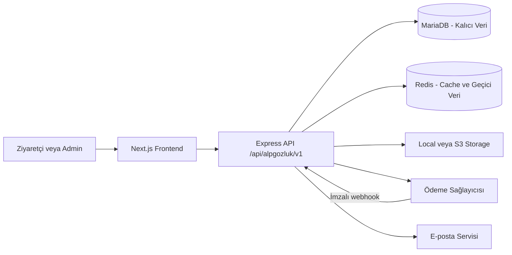

# ALP Gözlük — Mimari ve Geliştirme Yol Haritası

Bu belge projenin kalıcı mimari karar kaynağıdır. Uygulama ilerledikçe tamamlanan aşamalar ve değişen kararlar burada güncellenir.

## Temel kararlar

- Repository `frontend/`, `backend/` ve `sql/` olarak ayrılır.
- Frontend; Next.js App Router, JavaScript, Tailwind CSS, next-intl, shadcn/ui, React Hook Form ve Zod kullanır.
- Backend; Express.js, CommonJS, `mysql2/promise`, MariaDB 11.4 LTS ve Redis kullanır.
- MariaDB sipariş, ödeme, stok, fiyat, müşteri ve sepet gibi kalıcı verilerin tek doğruluk kaynağıdır.
- Redis cache, rate limit ve kısa ömürlü güvenlik verileri için kullanılır. Sipariş, ödeme, fiyat veya stok yalnızca Redis'te tutulmaz.
- Storage, `local` ve S3-compatible adaptörlerle aynı servis arayüzünü sunar. Veritabanında sağlayıcı URL'si değil storage key saklanır.
- Mevcut paylaşımlı MariaDB 10.6 yeni e-ticaret production veritabanı olarak kullanılmaz.

## Sistem akışı



## Frontend route mimarisi

```text
src/app/
├── layout.jsx
├── (site)/
│   └── [locale]/
│       ├── page.jsx
│       ├── shop/
│       ├── category/[slug]/
│       ├── collection/[slug]/
│       ├── product/[slug]/
│       ├── search/
│       ├── cart/
│       ├── checkout/
│       ├── account/
│       └── legal/[slug]/
├── (auth)/[locale]/
│   ├── login/
│   ├── register/
│   ├── forgot-password/
│   ├── reset-password/[token]/
│   └── verify-email/
└── (admin)/admin/
    ├── login/
    └── (panel)/
        ├── products/
        ├── categories/
        ├── collections/
        ├── inventory/
        ├── orders/
        ├── customers/
        ├── campaigns/
        ├── content/
        ├── media/
        ├── users/
        ├── roles/
        ├── audit-logs/
        └── settings/
```

Route group isimleri URL'ye yansımaz. Varsayılan locale Türkçedir ve URL'de prefix kullanmaz: ana sayfa `/`, müşteri girişi `/login`, mağaza `/shop` olarak açılır. Diğer diller locale prefix'i kullanır; örneğin İngilizce ana sayfa `/en`, müşteri girişi `/en/login` ve mağaza `/en/shop` olur. Eski veya gereksiz `/tr/...` adresleri prefixsiz Türkçe karşılıklarına yönlendirilir. Admin paneli `/admin` altında localesiz çalışır.

## Storage sözleşmesi

Controller ve domain servisleri yalnızca aşağıdaki storage arayüzünü kullanır:

```text
save(file, options)
delete(fileKey, options)
getUrl(fileKey, options)
```

- Development varsayılanı local storage'dır.
- Production varsayılanı S3-compatible storage'dır.
- Public medya `public/`, private medya `private/` key prefix'i kullanır.
- Public medyada CDN/public base URL; private medyada kısa ömürlü imzalı URL kullanılır.
- JPEG, PNG, WebP ve AVIF dışındaki ürün görselleri reddedilir.
- Yeni dosya ve veritabanı kaydı başarılı olmadan eski dosya silinmez.

## Redis kullanım sınırları

- Ürün, kategori, koleksiyon ve ana sayfa cache'i
- Login ve abuse-sensitive endpoint rate limit'leri
- OTP ve başarısız giriş sayaçları
- JWT denylist/session iptali
- İhtiyaç kanıtlanırsa BullMQ tabanlı arka plan işleri

İlk sürümde sepet ve favoriler Redis'te tutulmaz veya cache'lenmez. Redis çalışmazsa katalog, sepet ve favoriler MariaDB üzerinden devam eder. Cache yazma hatası kullanıcı isteğini başarısız yapmaz; güvenlik kontrollerindeki fallback ise loglanır ve sınırlı çalışır. Sepet özeti için Redis cache'i ancak ölçülmüş bir ihtiyaç oluşursa sonraki fazda değerlendirilir.

## Sepet ve favori sözleşmesi

- MariaDB; kullanıcı ve misafir sepetlerinin, hesap favorilerinin, fiyatların, stokların, indirimlerin ve kupon ilişkilerinin tek doğruluk kaynağıdır.
- Frontend yalnız `@tanstack/react-query` ile server state senkronizasyonu, optimistic update, rollback ve query invalidation yapar. Redux Toolkit, Zustand, SWR ve kalıcı Query cache kullanılmaz.
- Misafir sepeti `alp_guest_cart` adlı `HttpOnly`, `SameSite=Lax` ve production'da `Secure` cookie ile tanımlanır. Cookie'deki 256-bit rastgele token'ın yalnız SHA-256 hash'i MariaDB'de saklanır.
- Misafir favorilerinde yalnız ürün kimlikleri, en fazla 100 kayıt olacak şekilde `alp_guest_favorites_v1` anahtarıyla tarayıcıda tutulur. Fiyat, isim ve görsel localStorage'a yazılmaz.
- Giriş sonrasında misafir sepeti transaction içinde hesap sepetiyle birleştirilir. Aynı varyantların adetleri stok ve satır limitine göre sınırlandırılır; seçim durumu OR mantığıyla birleşir.
- Sepet/favori merge işlemleri idempotenttir. Başarısız merge kullanıcı girişini engellemez ve sonraki commerce isteğinde tekrar denenebilir.
- Seçimi kaldırılan sepet satırları sepet adedinde kalır; fiyat ve checkout toplamına dahil edilmez.
- Frontend fiyat, indirim, stok veya toplamı güvenilir veri olarak API'ye göndermez. Backend her mutation ve checkout öncesinde kanonik değerleri yeniden hesaplar.
- Guest checkout desteklenir; hesap açmak zorunlu değildir.

Frontend query anahtarları:

```text
['commerce', 'cart']
['commerce', 'cart', 'summary']
['commerce', 'favorites', 'ids']
['commerce', 'favorites', 'list']
```

Demo katalog artık frontend sabiti değildir. `npm run db:seed:demo-catalog` komutu ürünleri, varyantları, stokları, markaları, kategorileri, özellikleri, kuponu ve medya kayıtlarını idempotent biçimde hazırlar. Görsel dosyaları aynı storage adapter'ı üzerinden development'ta local, production'da S3-compatible depoya aktarılır. Seed tekrar çalıştırıldığında mevcut stok satış hareketleri sıfırlanmaz.

## Sipariş çekirdeği — Aşama 9A

Aşama 9A'nın ödeme sağlayıcısından bağımsız uygulama çekirdeği tamamlanmıştır:

- Sipariş durumu: `pending_payment → processing → shipped → delivered`; ödeme öncesi veya izin verilen operasyonlarda `cancelled`.
- Ödeme durumu: `initialized → pending → paid / failed / cancelled / expired`; başarılı ödemeden sonra `partially_refunded → refunded`.
- Gönderim durumu: `unfulfilled → preparing → shipped → delivered`; ayrıca `returned` ve `cancelled`.
- Checkout başladığında seçili varyant satırları transaction içinde kilitlenir, stok 20 dakika için ayrılır ve satılabilir `stock_quantity` aynı transaction'da azaltılır.
- Ödeme başarılı olduğunda rezervasyon `committed` olur. İptal veya süre aşımında yalnız aktif rezervasyonlar bir kez geri bırakılır ve inventory movement kaydı oluşturulur.
- İç `orders.id` API'de sipariş kimliği olarak kullanılmaz. Müşteriye `AG-YY-XXXXXXXXXX` biçiminde, belirsiz karakterleri içermeyen ve 50-bit rastgele bölüm taşıyan `order_number` gösterilir.
- Checkout isteği zorunlu `Idempotency-Key` ile tekrar gönderilebilir; aynı anahtar ikinci sipariş veya ikinci stok düşümü üretmez.
- Misafir siparişinde sepet token'ından ayrı üretilen 256-bit rastgele erişim anahtarının yalnız SHA-256 hash'i saklanır. Sipariş numarası veya sepet token'ı tek başına erişim sağlamaz.
- Ürün kodu, marka, ad, SKU, renk, ölçü, ana görsel storage bilgisi, birim fiyat, indirim, vergi, toplam, müşteri, adres, kupon ve kargo yöntemi sipariş anında snapshot olarak saklanır.
- Ödeme başarılı olduğunda yalnız siparişe dönüşen sepet satırları temizlenir; seçilmemiş satırlar korunur.
- `npm run stock:expire` süresi geçen rezervasyonları serbest bırakır. Production'da `npm run stock:expire:production` komutu dakikada bir çalışan tek bir cron/worker tarafından tetiklenmelidir; birden fazla scheduler aynı görevi paralel başlatmamalıdır.
- `npm run test:order-core:db` gerçek development veritabanında sepet ekle/güncelle/seç/kaldır, rezervasyon, idempotency, iptal, başarısız ödeme, stok iadesi ve ödeme kesinleştirme akışını doğrulayıp kendi kayıtlarını temizler.

25 Eylül 2026 doğrulamasında backend testlerinin tamamı (`48/48`) ve gerçek veritabanı sipariş smoke testi geçmiştir. Bununla birlikte aşağıdaki maddeler production kapanış işi olarak açık tutulur; bunlar tamamlanmadan 9A'nın operasyonel olarak kapandığı varsayılmaz:

- [ ] Süresi geçmiş rezervasyon zorlanarak `expireReservations` akışının stoğu yalnız bir kez geri verdiği ve ikinci çalıştırmanın etkisiz kaldığı gerçek DB smoke testine eklenmeli.
- [ ] Gerçek bir `payments` satırı üzerinden `paymentId` ile başarı/başarısızlık kesinleştirme dalları 9B entegrasyon testlerinde doğrulanmalı. Mevcut smoke testi sağlayıcıdan bağımsız sınırı `paymentId = null` ile sınar.
- [ ] Production ortamı seçildiğinde dakikada bir çalışan tek `stock:expire:production` cron/worker görevi gerçekten kurulup gözlemlenmeli. Repository'de komut vardır; deployment scheduler tanımı henüz yoktur.

Bu ayrım önemlidir: `commitPaidOrder` ve `failOrderPayment` transaction sınırları hazırdır; iyzico ödeme denemesi oluşturmak, sağlayıcı sonucunu doğrulamak ve bu sınırları gerçek `paymentId` ile çağırmak Aşama 9B'nin sorumluluğudur.

## Ödeme, kargo ve iade teslimat sırası

### Şimdiki adım — 9B: iyzico Direct API, zorunlu 3DS ve sandbox

25 Eylül 2026 tarihli ürün kararıyla ilk sürümde iyzico Checkout Form yönlendirmesi yerine iyzico Direct API kullanılır. Kart numarası, kart sahibi, son kullanma tarihi ve CVC alanları ALP Gözlük checkout arayüzünde, sitenin kendi tasarım diliyle gösterilir; kart verisi yalnız ödeme anında ayrılmış Express ödeme ucundan iyzico'ya iletilir. Bütün kart ödemeleri zorunlu 3D Secure olarak başlatılır. Non-3DS ve kart saklama ilk sürüm kapsamı dışındadır.

AlışverişKapıda yalnız SDK çağrı sırası, sandbox/live ayrımı ve 3DS akışını anlamak için teknik referanstır. Checkout görseli, bileşenleri veya büyük ödeme controller'ı kopyalanmaz. Hosted Checkout Form, Direct API için production PCI/onay şartları karşılanamazsa kullanılabilecek geri dönüş seçeneğidir; aynı anda ikinci bir aktif ödeme akışı olarak tutulmaz.

9B aşağıdaki sırayla tamamlanır:

1. **9B.1 — Sağlayıcı ve compliance sınırı:** Resmî `iyzipay` Node.js SDK'sı, sandbox/live config ayrımı, zorunlu env değerleri ve sabit güvenilir callback URL'si hazırlanır. iyzico'ya özel kod küçük bir payment adapter/service sınırında tutulur; sipariş servisi sağlayıcıdan bağımsız kalır. Production geliştirmesi bitmiş sayılsa bile, iyzico/acquirer ile Direct API kullanımının ve PCI DSS kapsamının yazılı olarak netleştirilmesi; gerekiyorsa QSA/ASV sürecinin tamamlanması canlıya çıkış kapısıdır.
2. **9B.2 — Ödeme denemesi ve kart verisi sınırı:** `Satın Al` isteğinde backend sepeti ve sipariş snapshot'ını kanonik olarak yeniden doğrular, stok rezervasyonunu oluşturur ve siparişe bağlı benzersiz `payments` denemesini `initialized` durumunda yazar. Kart alanları yalnız ayrılmış ödeme endpoint'inde kabul edilir; controller/service boyunca açık allowlist kullanılır. PAN ve CVC veritabanı, Redis, session, cookie, dosya, audit log, request log, APM veya hata izleme sistemine yazılmaz. CVC hiçbir biçimde saklanmaz; başarılı sağlayıcı cevabından yalnız izin verilen kart markası, BIN ve son dört hane tutulabilir. Frontend de kart alanlarını `localStorage` veya benzeri kalıcı depoya yazmaz.
3. **9B.3 — BIN ve taksit sorgusu:** Kartın yalnız gerekli ilk sekiz hanesi, rate limit uygulanmış backend ucu üzerinden iyzico BIN/taksit servisine gönderilir. Taksit sayıları ve toplamları frontend tarafından üretilmez; iyzico cevabı ve işyeri sözleşmesinin izin verdiği seçenekler gösterilir. Taksit yetkisi henüz açık değilse güvenli varsayılan tek çekimdir. Tam kart numarası BIN cache anahtarına veya loglara girmez.
4. **9B.4 — Init 3DS:** `price`, `paidPrice`, para birimi, sepet, alıcı ve adres bilgileri request toplamlarından değil sipariş snapshot'ından üretilir. `registerCard = 0` ile zorunlu 3DS Initialize çağrısı yapılır; `conversationId`, `basketId`, payment attempt ve sipariş eşleşmesi saklanır. Başarılı Init sonucunda deneme `pending` olur. 3DS HTML içeriği ana uygulamayı `document.write()` ile değiştirmek yerine, dar yetkili ve tek kullanımlık bir 3DS köprü sayfasında çalıştırılır. Init kesin olarak başarısızsa deneme başarısızlaştırılır ve rezervasyon idempotent biçimde bırakılır; sonucu belirsiz ağ hataları doğrudan başarısız sayılmadan önce uzlaştırılır.
5. **9B.5 — Callback, Auth 3DS ve merkezi kesinleştirme:** Callback'teki `mdStatus`, `paymentId` veya yönlendirme parametreleri tek başına ödeme kanıtı sayılmaz. Backend callback korelasyonunu kontrol eder, iyzico Auth 3DS çağrısını yapar, response signature'ını ve `conversationId`, `basketId`, tutar, para birimi, ödeme kimliği ile sipariş eşleşmesini doğrular. Ödeme ancak sağlayıcı sonucu başarılı, `fraudStatus = 1` ve ilgili kalem transaction durumları onaylıysa `commitPaidOrder` ile kesinleşir. `fraudStatus = 0` incelemede kabul edilir ve sipariş sevke açılmaz; terminal başarısız sonuç yalnız `failOrderPayment` üzerinden işlenir. İleride kalem bazlı refund için her `order_item` ile iyzico `paymentTransactionId` eşleşmesi saklanır.
6. **9B.6 — Webhook, süre aşımı ve uzlaştırma:** Direct API webhook'u `X-IYZ-SIGNATURE-V3` ile doğrulanır ve olay `payment_webhook_events` benzersizliğiyle idempotent kaydedilir. Callback ile webhook aynı anda veya tekrar geldiğinde satır kilitleri ve durum kontrolleri sayesinde ikinci sipariş, ikinci kupon kullanımı ya da ikinci stok hareketi oluşmaz. Süre aşımı worker'ı aktif Init/Auth işlemini körlemesine serbest bırakmaz; sağlayıcı sonucu uzlaştırılır, belirsiz sonuç kontrollü yeniden denemeye ve operasyon kaydına alınır. Webhook kritik verinin tek doğruluk kaynağı değil, Auth 3DS sonucunun uzlaştırma kanalıdır.
7. **9B.7 — Sandbox, güvenlik ve yarış testleri:** Başarılı 3DS, yetersiz bakiye, hatalı CVC, 3DS Initialize hatası, `mdStatus` başarısızlığı, geçersiz response/webhook imzası, Auth eşleşme hatası, kullanıcı terk etmesi, çift `Satın Al`, çift callback, tekrar webhook, callback-webhook yarışı, geç callback, son stok için iki eşzamanlı checkout ve başarılı ödemenin yalnızca bir kez kesinleşmesi otomatik doğrulanır. Kart verisinin log/DB/cache/APM çıktısına sızmadığı güvenlik testiyle kontrol edilir. 9A'daki süre aşımı ve gerçek `paymentId` test borçları da burada kapatılır.

Teknik bağlantı sırası değişmez:

```text
checkout/sipariş oluştur
→ stok rezervasyonu
→ payment attempt oluştur
→ iyzico Init 3DS
→ izole 3DS doğrulama ekranı
→ callback korelasyonu
→ iyzico Auth 3DS + response signature/eşleşme doğrulaması
→ idempotent commitPaidOrder veya failOrderPayment
→ sonuç sayfası
```

Resmî uygulama referansları:

- Direct API ödeme modeli: https://docs.iyzico.com/en/payment-methods/api
- 3DS akışı: https://docs.iyzico.com/en/payment-methods/api/3ds/3ds-implementation
- BIN ve taksit servisi: https://docs.iyzico.com/en/advanced/installment-and-bin-service
- Response signature: https://docs.iyzico.com/en/advanced/response-signature-validation
- Webhook ve `X-IYZ-SIGNATURE-V3`: https://docs.iyzico.com/en/advanced/webhook
- Sandbox hesabı: https://docs.iyzico.com/on-hazirliklar/sandbox
- Sandbox/live ayrımı: https://docs.iyzico.com/on-hazirliklar/live-vs-sandbox
- Resmî test kartları: https://docs.iyzico.com/ek-bilgiler/test-kartlari
- Hata kodları: https://docs.iyzico.com/en/add-ons/error-codes
- Resmî Node.js SDK: https://github.com/iyzico/iyzipay-node
- PCI ödeme sayfası kapsam farkı: https://www.pcisecuritystandards.org/faqs/1291/

### Sandbox verisi ve erişim

- Test kartlarının tek doğruluk kaynağı iyzico'nun resmî test kartları sayfasıdır; AlışverişKapıda'daki sabitler veya rastgele internet listeleri kanonik kaynak değildir.
- Başarılı kredi kartı örneği `5526080000000006`; yetersiz bakiye `4111111111111129`; hatalı CVC `4124111111111116`; başarısız 3DS Initialize `4151111111111112`; özel `mdStatus` senaryoları `4131111111111117` ve `4141111111111115` ile test edilir. Liste güncellenebileceği için test fixture'ı hazırlanırken resmî sayfa yeniden kontrol edilir.
- Sandbox kartlarında CVC doğru formatta rastgele bir değer, son kullanma tarihi ise gelecekte bir tarih olabilir. Sandbox OTP değeri resmî dokümana göre `123456` değeridir. Bunlar yalnız sandbox ortamında kullanılır; gerçek kartla sandbox testi yapılmaz.
- Sandbox hesabı `https://sandbox-merchant.iyzipay.com/auth/register` adresinden kullanıcı tarafından açılır. API Key ve Secret Key panelde `Ayarlar → Firma Ayarları → API Anahtarları` bölümünden alınır. Anahtarlar sohbete, issue'ya, roadmap'e, test fixture'ına veya Git'e yazılmaz; yalnız ilgili development env/secret yönetimine eklenir.
- Sandbox ve live base URL/credential çiftleri ayrı config olarak tutulur. Production süreç hiçbir koşulda sandbox anahtarına veya test kartına sessizce düşmez; yanlış ortam eşleşmesinde uygulama başlangıçta hata verir.

### 9B sonrasındaki sıra

1. **9C — Checkout frontend'i:** Misafir ve üyelikli checkout ALP Gözlük'ün mevcut public tasarım diliyle sıfırdan hazırlanır; AlışverişKapıda UI referansı kullanılmaz. Masaüstünde içerik + sticky sipariş özeti, mobilde tek kolon + klavye ve safe-area uyumlu eylem alanı; `Sepet özeti → Teslimat ve ödeme → Sipariş sonucu` ilerlemesi; ürün özeti accordion'u, adres/fatura, kargo, kendi kart formumuz, taksitler, sözleşme onayı ve sonuç durumları bulunur. Form köşeli, sade, nefes alan, responsive ve erişilebilir olur; ağır dekoratif animasyon kullanılmaz. Kart alanları küçük ve izole Client Component içinde yalnız bellekte tutulur, uygun `autocomplete` değerlerini kullanır, mobilde en az 16px input yazısı ve erişilebilir hata/odak durumları sağlar. `Satın Al` sırasında çift gönderim engellenir; kart değerleri TanStack Query cache'ine, global store'a, URL'ye veya kalıcı browser storage'a girmez. Bekleniyor/başarılı/başarısız/incelemede/rezervasyon süresi doldu ekranları backend'in kanonik durumunu okur.
2. **9D — Tek kargo firması:** Shipment kaydı, takip numarası, kargoya verildi/teslim edildi durumları, admin operasyonu ve sağlayıcı webhook/polling adaptörü.
3. **9E — İade talebi ve admin onayı:** Müşteri iade talebi, kalem/adet/neden seçimi, ayrı ve tahmin edilmesi zor `return_number`, uygunluk ve durum geçmişi.
4. **9F — Para iadesi:** Onaylı/teslim alınmış iade sonrasında 9B'de saklanan kalem `paymentTransactionId` değerleri kullanılarak iyzico refund yapılır; bizim ayrı `refund_number` değerimiz ile iyzico `provider_refund_id` birlikte tutulur. İade talebi numarası para iadesi numarası değildir.
5. **9G — Transactional e-posta ve sipariş operasyonu:** Sipariş alındı, ödeme, kargo, teslim, iade ve refund e-postaları; admin sipariş/iade/refund ekranları ve yeniden deneme/uzlaştırma araçları.

Filtreleme, ürün detayları ve ana sayfa geliştirmeleri bu backend sırasını beklemek zorunda değildir; ancak ödeme-kargo-iade backend işlerinde yukarıdaki sıra korunur.

## Varyant bazlı stok yönetimi

- Satılabilir stok yalnız `product_variants.stock_quantity` alanında tutulur. Aktif checkout rezervasyonlarının toplamı `stock_reservations` üzerinden hesaplanır; fiziksel stok kullanılabilir ve ayrılmış stok toplamıdır.
- Ürün oluştururken her varyant için, başlangıç miktarı sıfır olsa da `initial_stock` hareketi yazılır. Admin artırma/azaltmaları varyant satırını transaction içinde kilitler, negatif stoğu reddeder ve hem `inventory_movements` hem `audit_logs` kaydı üretir.
- `GET /admin/inventory` kullanılabilir, ayrılmış ve fiziksel stoğu; `POST /admin/inventory/:variantId/adjustments` kontrollü stok hareketini; `PATCH /admin/inventory/:variantId` düşük stok eşiğini; `GET /admin/inventory/:variantId/movements` hareket geçmişini yönetir. Tüm uçlar `inventory.manage` izni ister.
- Public ürün listesi `inStockVariantCount`, `isInStock` ve `stockStatus` döndürür. Aktif ama tükenen varyant detayda görünür ve seçilemez; tamamen tükenen ürün katalogda kalır, stoklu ürünlerden sonra sıralanır.
- Stok taşıyan ürün listesi ve ürün detayı Redis/Next.js süreli cache kullanmaz. Facet, navigasyon ve stok taşımayan katalog sözlükleri cache'li kalır.
- `npm run test:inventory:db` admin artırma/azaltma, negatif stok koruması, hareket ve audit kayıtlarını gerçek development veritabanında doğrular ve test değişikliklerini temizler.

## Katalog taksonomisi ve navigasyon

Katalog verisi aşağıdaki sorumluluklara ayrılır:

- `audiences` ve `product_audiences`: kadın, erkek, çocuk ve unisex hedef kitleleri
- `attribute_groups` / `attribute_values`: ürün tipi, çerçeve materyali, form, cam özelliği, renk ve ölçü filtreleri
- `categories`: kalıcı katalog hiyerarşisi
- `collections`: yaz seçkisi, dört mevsim ve benzeri editoryal/sezonluk seçkiler
- `brands`: tekrar kullanılabilir marka kayıtları
- `navigation_menus` / `navigation_items`: header mega menüsü ve lokalize bağlantıları

Kadın katalog sorgusu `women + unisex`, erkek sorgusu `men + unisex`, çocuk sorgusu yalnızca `kids` hedef kitlesini döndürür. Böylece unisex bir ürün kopyalanmadan iki katalogda görünür; ürün kimliği, slug, stok, fiyat, medya ve SEO verisi tek kayıtta kalır.

Güneş gözlüğü ve optik çerçeve ürün tipi; polarize, materyal, form, renk ve ölçü ise filtre özelliğidir. `Yeni gelenler` tarih/sıralama, `İndirim` aktif varyant fiyatı, sezon anlatıları ise koleksiyon üzerinden hesaplanır. Bu kavramlar kategori olarak çoğaltılmaz.

Public API uçları:

```text
GET /api/alpgozluk/v1/products
GET /api/alpgozluk/v1/catalog/facets
GET /api/alpgozluk/v1/navigation/header
```

Admin katalog ve navigasyon uçları authentication yanında `catalog.manage` veya `navigation.manage` permission kontrolü uygular. Header verisi Redis'te locale bazlı cache'lenir; ürün veya taksonomi değişikliğinde ilgili katalog cache prefix'i temizlenir.

Public URL yapısı:

```text
/{locale?}/shop
/{locale?}/shop/{audience}
/{locale?}/shop/{audience}/{product-type}
/{locale?}/category/{slug}
/{locale?}/collection/{slug}
/{locale?}/product/{slug}
```

Buradaki `{locale?}` Türkçe için boş, diğer diller için zorunlu prefix'tir (`/shop`, `/en/shop`).

Filtreler `material`, `shape`, `frameType`, `feature`, `frameColor`, `lensColor`, `size`, `brand`, `priceMin`, `priceMax`, `sale`, `sort`, `page` ve `limit` query parametreleriyle taşınır. İçerik sayfaları slug tabanlı kalır; filtre kombinasyonları yeni ve kontrolsüz SEO sayfaları üretmez.

Ürün-varyant kararı:

- Ürüne ait ortak bilgiler, hedef kitle, kategori, koleksiyon, materyal ve form `products` ile `product_attribute_values` katmanında tutulur.
- SKU, barkod, fiyat, stok, üretici renk kodu, ölçüler ve müşterinin seçtiği renk/cam/beden seçenekleri `product_variants` ile `variant_attribute_values` katmanında tutulur.
- Her ürün en az bir satış varyantına sahiptir. Tek aktif varyant storefront'ta otomatik seçilir; birden fazla varyant varsa ilk stoklu varyant varsayılandır ve müşteri geçerli kombinasyonu açıkça seçebilir.
- Admin ürün formu aynı ürün altında birden fazla varyant oluşturur. Renk, cam rengi ve ölçü değerleri admin taksonomi ekranından yönetilir; forma sabit liste olarak gömülmez.
- Public ürün detayı varyant özelliklerini lokalize ad ve swatch değeriyle döndürür. Sepet satırı daima `variantId` üzerinden çalışır; böylece aynı ürünün farklı renk/ölçüleri ayrı satırlardır.
- Demo seed varyant özelliklerini idempotent biçimde yeniden bağlar; tekrar çalıştırma aynı ürünü/varyantı çoğaltmaz ve mevcut satış stoğunu sıfırlamaz.

## Arama, öneri ve gerçek zamanlı iletişim kararları

OpenSearch, TensorFlow/ALS ve Socket.IO ilk production sürümünün zorunlu altyapıları değildir. Bu teknolojiler yalnızca somut ürün ihtiyacı ve ölçülmüş veri oluştuğunda devreye alınır. AlışverişKapıda projesi uygulama kodu ve kullanım örneği olarak incelenebilir; çoklu mağaza, satıcı iletişimi ve geniş katalog ihtiyaçları ALP Gözlük'e doğrudan taşınmaz.

### Arama ve OpenSearch

- İlk sürümde ürün aramasının doğruluk kaynağı MariaDB'dir. Mevcut `LIKE` tabanlı arama geçici başlangıçtır; katalog büyümeden önce güvenli sorgu normalizasyonu, uygun indeksler, sonuç sayfası, sıralama ve arama analitiği tamamlanır.
- Frontend belirli bir arama motoruna bağlanmaz. Backend'de arama sözleşmesi sabit tutulur; ileride MariaDB uygulaması OpenSearch sağlayıcısıyla değiştirilebilmelidir.
- OpenSearch; yazım hatası toleransı, Türkçe metin analizi, gelişmiş autocomplete, relevance ağırlıkları, yoğun facet kullanımı veya ölçülen arama gecikmesi MariaDB çözümünü yetersiz bıraktığında değerlendirilir.
- OpenSearch kullanılırsa MariaDB tek doğruluk kaynağı olarak kalır; arama indeksi yeniden üretilebilir bir okuma modelidir. Ürün ekleme, güncelleme ve silme senkronizasyonu; toplu reindex, sağlık kontrolü, izleme ve OpenSearch kesintisi fallback'i birlikte tasarlanmadan production'a alınmaz.

### Öneri sistemi ve davranış verisi

- TensorFlow ve ALS aynı teknoloji değildir. TensorFlow tabanlı metin/embedding çözümleri ile ALS collaborative filtering modeli ayrı ihtiyaçlar olarak değerlendirilir; AlışverişKapıda uygulaması doğrudan kopyalanmaz.
- İlk öneriler makine öğrenmesi kullanmaz. Yeni gelenler, çok satanlar, aynı marka, benzer fiyat aralığı ve gözlüğün ürün tipi, hedef kitle, çerçeve şekli, materyali, rengi ve cam özellikleri gibi yönetilen katalog verileriyle kural tabanlı öneriler üretilir.
- Kişiselleştirme için model kurmadan önce `product_view`, `search_result_click`, `add_to_cart`, `purchase` ve gerekli diğer etkileşimlerin tutarlı event sözleşmesi hazırlanır. Üyelerde kullanıcı, misafirlerde anonim oturum kimliği kullanılır; hassas veri event payload'ına yazılmaz ve saklama/izin yaklaşımı production öncesinde belirlenir.
- Event altyapısının amacı ilk aşamada veri toplamak ve ölçüm yapmaktır; ayrı recommendation veritabanı, TensorFlow, Spark veya ALS kurulmasını zorunlu kılmaz.
- ALS ancak yeterli gerçek kullanıcı-ürün etkileşimi oluştuğunda, cold-start fallback'leri belirlendiğinde ve öneri kalitesi ölçülebilir hâle geldiğinde değerlendirilir. Model yokken veya kullanıcı/ürün yeniyken kural tabanlı öneriler çalışmaya devam eder.

### Socket.IO ve gerçek zamanlı özellikler

- İlk sürümde Socket.IO/WebSocket kullanılmaz. Mevcut HTTP API ve TanStack Query akışı sipariş, iade, hesap ve admin işlemleri için yeterlidir.
- Ödeme sonucu sağlayıcı webhook'u, kargo durumu webhook veya kontrollü sorgulama, transactional e-posta ise kalıcı iş akışı üzerinden yürür. Bu kritik süreçlerin doğruluğu aktif socket bağlantısına bağlı olmaz.
- Socket.IO; canlı destek, anlık kullanıcı bildirimi, admin ekranında anlık yeni sipariş görünümü veya çevrimiçi kullanıcı takibi gibi onaylanmış bir ürün ihtiyacı oluştuğunda eklenir.
- Gerçek zamanlı olaylar yalnız bildirim/invalidation katmanıdır. Kalıcı durum MariaDB'de saklanır; istemci bir olay aldığında kanonik veriyi API'den yeniden çeker. Bağlantı kesilmesi ödeme, sipariş, stok veya iade verisi kaybına neden olmaz.
- Çoklu backend instance'ına geçilirse Socket.IO adapter, mesaj dağıtımı ve load balancer oturum yönlendirmesi production tasarımının parçası olarak ayrıca ele alınır.

## Müşteri kimlik doğrulama

- E-posta/şifre ve Google Identity Services aynı uygulama session/JWT akışını üretir.
- Tarayıcı backend JWT'sini saklamaz; Next.js BFF token'ı `httpOnly`, `sameSite` cookie olarak yönetir.
- Google ID token'ı backend'de resmi Google Auth Library ile imza, issuer, audience ve süre açısından doğrulanır.
- Google `sub` değeri provider kimliğinin kalıcı anahtarıdır; e-posta provider kimliği olarak kullanılmaz.
- Google nonce 10 dakika geçerli, tek kullanımlı ve Redis desteklidir; frontend ayrıca challenge'ı `httpOnly` cookie ile aynı tarayıcı oturumuna bağlar.
- İlk Google girişinde müşteri hesabı otomatik oluşturulur. Mevcut şifreli hesap yalnızca e-posta eşleşmesine dayanarak otomatik bağlanmaz; bu, hesap ele geçirme riskini azaltır.
- Login sheet yalnızca giriş akışlarını içerir. Kayıt formu `/{locale?}/register` sayfasında kalır.

## Yönetim kimlik doğrulama ve roller

- Public kayıt her zaman yalnız `customer` rolü üretir; yönetici kayıt sayfası bulunmaz.
- İlk ve tek korumalı `super_admin`, env bilgilerini kullanan açık bir bootstrap komutuyla oluşturulur. Mevcut müşteri hesabı otomatik yükseltilmez.
- `super_admin` uygulama üzerinden silinemez, devre dışı bırakılamaz veya rolü değiştirilemez. `super_admin` rolü başka kullanıcılara atanamaz.
- Yalnız `super_admin`, panelden `admin` ve `editor` hesapları oluşturabilir ve bu rollerin atamasını değiştirebilir. Rol/durum değişiklikleri aktif oturumları iptal eder ve audit log üretir.
- Yönetici hesapları müşteri girişinden, müşteriler de admin girişinden oturum açamaz. Google girişi yönetici hesaplarında kullanılmaz.
- Yönetim 2FA'sı RFC 6238 TOTP standardındadır ve env üzerinden açılıp kapatılır; varsayılanı kapalıdır. Açıkken Redis challenge saklama ve deneme sınırı için zorunludur.
- TOTP secret AES-256-GCM ile şifreli, kurtarma kodları hash'li tutulur. Aynı zaman adımındaki kodun tekrar kullanımı engellenir.
- Standart TOTP nedeniyle Google Authenticator yanında Microsoft Authenticator, Authy, 1Password ve Bitwarden kullanılabilir.

## Güvenlik ilkeleri

- Fiyat, indirim, kargo, stok ve sipariş toplamı backend tarafından yeniden hesaplanır.
- Para alanları `DECIMAL` kullanır.
- Stok değişiklikleri MariaDB transaction ve satır kilitleriyle korunur.
- SQL sorguları parametreli çalışır; dinamik sıralama alanları allowlist kullanır.
- Admin endpoint'leri hem authentication hem permission kontrolü uygular.
- Upload alan adı, sayı, boyut, uzantı, MIME ve dosya imzası backend'de doğrulanır.
- S3, MariaDB ve Redis secret'ları frontend'e gönderilmez.
- Ödeme webhook'ları imzalı ve idempotent işlenir; kart verisi saklanmaz.

## Uygulama aşamaları

1. [x] Repository, environment ve dokümantasyon temeli
2. [x] Express, MariaDB, Redis, health ve güvenlik altyapısı
3. [x] Next.js route groups, next-intl ve uygulama kabukları
4. [x] MariaDB başlangıç şeması, rol/izin ve audit log
5. [x] Local/S3 storage ve güvenli medya yönetimi
6. [x] Admin ürün oluşturma → DB → cache invalidation → public ürün dikey akışı
7. [ ] Katalog filtreleme, MariaDB tabanlı gerçek arama ve ayrıntılı SEO
8. [x] Müşteri adresleri, MariaDB tabanlı kalıcı sepet ve favoriler
9. [ ] Checkout, stok transaction'ı, ödeme ve webhook
   - [x] 9A — Sağlayıcıdan bağımsız sipariş çekirdeği, snapshot, idempotency ve stok rezervasyonu uygulaması
     - [ ] 9A production kapanışı — süre aşımı DB smoke testi ve tekil production cron kurulumu
   - [ ] **ŞİMDİKİ ADIM: 9B — iyzico Direct API, zorunlu 3DS, payment attempt, Auth 3DS, response signature, V3 webhook ve sandbox/güvenlik testleri**
   - [ ] 9C — Kendi tasarım dilimizle misafir/üyelikli checkout, kart formu ve sipariş sonuç ekranı
   - [ ] 9D — Kargo gönderisi, takip numarası ve sipariş durum senkronizasyonu
   - [ ] 9E — İade talebi, ayrı `return_number` ve admin onayı
   - [ ] 9F — iyzico refund, ayrı `refund_number` ve `provider_refund_id`
   - [ ] 9G — Transactional e-posta ve sipariş/iade/refund operasyon ekranları
10. [ ] Admin operasyon modüllerinin CRUD akışları, staging ve production hazırlığı
   - [x] 10A — Varyant envanter listesi, kontrollü stok hareketi, düşük stok eşiği ve hareket geçmişi
11. [ ] Lansman sonrası davranış eventleri, arama ölçümleri ve kural tabanlı öneriler
12. [ ] Ölçülmüş ihtiyaca göre OpenSearch, ALS/TensorFlow ve Socket.IO değerlendirmesi

İlk altı aşamanın mimari ve çalışan iskeleti uygulanmıştır. Admin modül ekranları hazırdır; ürün oluşturma dışındaki CRUD iş akışları ilgili geliştirme aşamalarında API'lere bağlanacaktır. Şifre sıfırlama ve e-posta doğrulama ekranları mevcut olmakla birlikte e-posta sağlayıcısı seçilene kadar bilgilendirme durumundadır.

Yedinci aşamanın hedef kitle/özellik filtreleme, lokalize katalog URL'leri, yönetilebilir mega menü ve admin taksonomi CRUD bölümü uygulanmıştır. İlk gerçek arama MariaDB üzerinde tamamlanacaktır; OpenSearch bu aşamanın kabul kriteri değildir. Arama sonuç sayfası, canonical stratejisi, breadcrumb/schema çıktıları ve ileri SEO çalışmaları tamamlanmadığı için aşama henüz kapatılmamıştır.

Sekizinci aşamada misafir ve kullanıcı sepetleri, hesap ve misafir favorileri, login sonrası idempotent birleştirme, ürün seçimi, kupon, fiyat/stok uyarıları ve TanStack Query tabanlı optimistic arayüz akışları tamamlanmıştır. Sepet stok rezervasyonu yapmaz; kesin fiyat ve stok kontrolü checkout aşamasında yapılacaktır.

Dokuzuncu aşamanın 9A uygulama çekirdeği tamamlanmış ve 25 Eylül 2026 tarihinde backend testleri ile gerçek DB smoke testi yeniden geçmiştir. Süre aşımı DB smoke kapsamı ve production tekil cron kurulumu açık production kapanış maddeleridir. Bir sonraki geliştirme adımı 9B.1'de iyzico Direct API sağlayıcı/compliance sınırını ve sandbox sözleşmesini hazırlamak, ardından gerçek `payments` denemelerini mevcut `commitPaidOrder` / `failOrderPayment` transaction sınırlarına bağlamaktır. Kart alanları kendi checkout tasarımımızda bulunacak ve kart verisi yalnız ayrılmış ödeme endpoint'inden bellekte işlenerek iyzico'ya iletilecektir; kalıcı depoya veya loglara girmeyecektir. Callback parametreleri tek başına güvenilir sayılmayacak, Auth 3DS cevabı, response signature ve sipariş/tutar eşleşmeleri tamamlandıktan sonra sipariş kesinleştirilecektir.

On birinci ve on ikinci aşamalar ilk production yayınının ön koşulu değildir. Bu aşamalar, gerçek kullanım verisi toplandıktan ve temel ticaret akışları kararlı hâle geldikten sonra ele alınır. İleri teknoloji kurulumu kendi başına hedef veya tamamlanma ölçütü sayılmaz; kullanıcı deneyimine ve operasyonel ihtiyaca kanıtlanabilir katkı sağlamalıdır.

## Açık dış entegrasyon kararları

Aşağıdaki sağlayıcılar seçilmeden production entegrasyonu tamamlanmış sayılmaz:

- Ödeme kuruluşu: teknik hedef iyzico Direct API + zorunlu 3DS sandbox; production sözleşmesi, Direct API/3DS aktivasyonu, PCI kapsam teyidi ve canlı anahtarlar bekleniyor
- Kargo kuruluşu
- Transactional e-posta servisi
- S3-compatible production storage sağlayıcısı
- Production MariaDB ve Redis barındırma ortamı

Bu kararlar seçildiğinde mevcut adapter/config sınırları üzerinden entegre edilir; controller veya frontend mimarisi yeniden yazılmaz.

## Production öncesi zorunlu kontrol listesi

Bu maddeler tamamlanmadan production yayını yapılmaz:

- [ ] **MariaDB sürümü:** MariaDB 10.6 geliştirme ortamında şimdilik kullanılabilir; production hedefimiz hâlâ ayrı MariaDB 11.4 LTS olmalı.
- [ ] MariaDB 11.4 mevcut projelerden izole bir instance/sunucuda hazırlanmalı.
- [ ] Production şeması sıralı SQL dosyalarıyla temiz ortamda kurulup doğrulanmalı.
- [ ] Otomatik yedekleme, geri yükleme ve geri dönüş senaryosu staging ortamında test edilmeli.
- [ ] Production `DB_*` değerleri yalnızca yeni MariaDB 11.4 instance'ını göstermeli; paylaşımlı MariaDB 10.6 kullanılmamalı.
- [ ] Redis servis sağlığı, kalıcılık tercihi, erişim kısıtları ve backend fallback davranışı staging'de doğrulanmalı.
- [ ] Süresi dolan stok rezervasyonları için `npm run stock:expire:production` dakikada bir çalışan tek bir cron/worker olarak kurulmalı; başarısız çalıştırmalar log ve alarm üretmeli.
- [ ] iyzico callback adresi public HTTPS ve sabit allowlist config'iyle hazırlanmalı; sandbox/live anahtarları ile base URL'ler birbirine karışmamalı.
- [ ] iyzico hesabında Direct API/3DS ve webhook signature özellikleri etkinleştirilmeli; staging'de Init/Auth 3DS, Auth response signature, `X-IYZ-SIGNATURE-V3`, tekrar bildirim ve callback-webhook yarışı doğrulanmalı.
- [ ] Direct API nedeniyle kart verisinin geçtiği browser sayfası, CDN/WAF/load balancer ve Express ödeme bileşenlerinin PCI DSS kapsamı iyzico/acquirer ile yazılı olarak doğrulanmalı; gerekiyorsa QSA/ASV süreci canlı yayından önce tamamlanmalı.
- [ ] Kart numarası ve CVC'nin DB, Redis, session, cookie, request/audit log, reverse-proxy logu, APM, hata izleme, analytics ve destek araçlarına girmediği staging güvenlik testiyle kanıtlanmalı; ödeme endpoint'i için merkezi redaction ve body-log yasağı doğrulanmalı.
- [ ] Checkout sayfasında gereksiz üçüncü taraf scriptler çalıştırılmamalı; CSP, HSTS, TLS, CORS/CSRF, rate limit, dependency/vulnerability taraması ve script değişiklik kontrolü staging'de doğrulanmalı.
- [ ] Production `buyer.identityNumber` kaynağı, kullanıcıya açıklanması ve saklama/iletme politikası iyzico sözleşmesi ile KVKK/hukuk değerlendirmesinde kesinleştirilmeli; canlıda örnek veya sabit kimlik numarası kullanılmamalı.
- [ ] Ön bilgilendirme ve mesafeli satış sözleşmesi metinleri hukuk kontrolünden geçirilmeli; sürüm/hash, doldurulmuş snapshot, kabul zamanı ve ispat kayıtlarının siparişle ilişkisi doğrulanmalı.
- [ ] Tek kullanımlık bootstrap komutuyla korumalı `super_admin` oluşturulmalı; bootstrap e-posta ve şifresi env dosyasından hemen temizlenmeli.
- [ ] `ADMIN_2FA_ENABLED=true` yapılmadan önce ayrı development/staging doğrulaması tamamlanmalı ve `ADMIN_2FA_ENCRYPTION_KEY` güvenli secret yönetimine taşınmalı.
- [ ] Yönetim 2FA'sı açıkken Redis kesintisinin yönetici girişini güvenli biçimde kapattığı test edilmeli.
