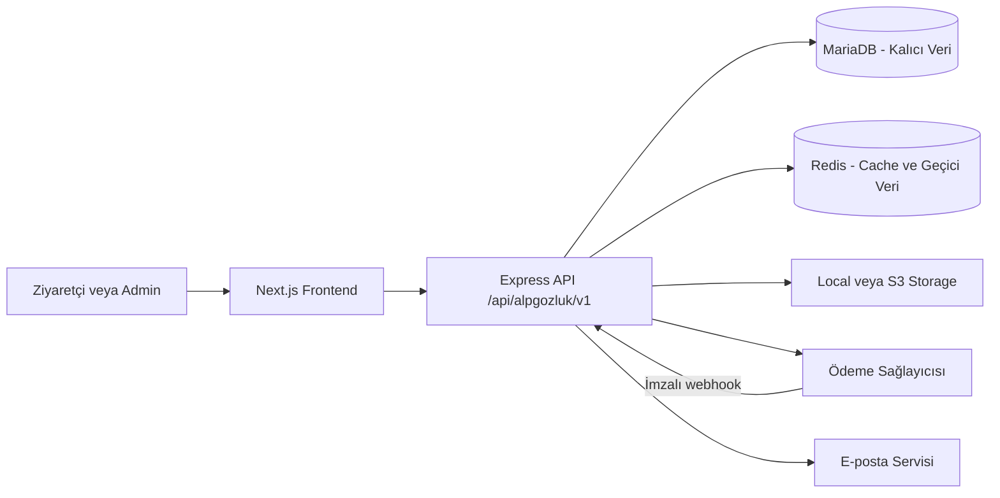

# ALP Gözlük — Mimari ve Geliştirme Yol Haritası

Bu belge projenin kalıcı mimari karar kaynağıdır. Uygulama ilerledikçe tamamlanan aşamalar ve değişen kararlar burada güncellenir.

## Temel kararlar

- Repository `frontend/`, `backend/` ve `sql/` olarak ayrılır.
- Frontend; Next.js App Router, JavaScript, Tailwind CSS, next-intl, shadcn/ui, React Hook Form ve Zod kullanır.
- Backend; Express.js, CommonJS, `mysql2/promise`, MariaDB 11.4 LTS ve Redis kullanır.
- MariaDB sipariş, ödeme, stok, fiyat, müşteri ve sepet gibi kalıcı verilerin tek doğruluk kaynağıdır.
- Redis cache, rate limit ve kısa ömürlü güvenlik verileri için kullanılır. Sipariş, ödeme, fiyat veya stok yalnızca Redis'te tutulmaz.
- Storage, `local` ve S3-compatible adaptörlerle aynı servis arayüzünü sunar. Veritabanında sağlayıcı URL'si değil storage key saklanır.
- Mevcut paylaşımlı MariaDB 10.6 yeni e-ticaret production veritabanı olarak kullanılmaz.

## Sistem akışı



## Frontend route mimarisi

```text
src/app/
├── layout.jsx
├── (site)/
│   └── [locale]/
│       ├── page.jsx
│       ├── shop/
│       ├── category/[slug]/
│       ├── collection/[slug]/
│       ├── product/[slug]/
│       ├── search/
│       ├── cart/
│       ├── checkout/
│       ├── account/
│       └── legal/[slug]/
├── (auth)/[locale]/
│   ├── login/
│   ├── register/
│   ├── forgot-password/
│   ├── reset-password/[token]/
│   └── verify-email/
└── (admin)/admin/
    ├── login/
    └── (panel)/
        ├── products/
        ├── categories/
        ├── collections/
        ├── inventory/
        ├── orders/
        ├── customers/
        ├── campaigns/
        ├── content/
        ├── media/
        ├── users/
        ├── roles/
        ├── audit-logs/
        └── settings/
```

Route group isimleri URL'ye yansımaz. Varsayılan locale Türkçedir ve URL'de prefix kullanmaz: ana sayfa `/`, müşteri girişi `/login`, mağaza `/shop` olarak açılır. Diğer diller locale prefix'i kullanır; örneğin İngilizce ana sayfa `/en`, müşteri girişi `/en/login` ve mağaza `/en/shop` olur. Eski veya gereksiz `/tr/...` adresleri prefixsiz Türkçe karşılıklarına yönlendirilir. Admin paneli `/admin` altında localesiz çalışır.

## Storage sözleşmesi

Controller ve domain servisleri yalnızca aşağıdaki storage arayüzünü kullanır:

```text
save(file, options)
delete(fileKey, options)
getUrl(fileKey, options)
```

- Development varsayılanı local storage'dır.
- Production varsayılanı S3-compatible storage'dır.
- Public medya `public/`, private medya `private/` key prefix'i kullanır.
- Public medyada CDN/public base URL; private medyada kısa ömürlü imzalı URL kullanılır.
- JPEG, PNG, WebP ve AVIF dışındaki ürün görselleri reddedilir.
- Yeni dosya ve veritabanı kaydı başarılı olmadan eski dosya silinmez.

## Redis kullanım sınırları

- Ürün, kategori, koleksiyon ve ana sayfa cache'i
- Login ve abuse-sensitive endpoint rate limit'leri
- OTP ve başarısız giriş sayaçları
- JWT denylist/session iptali
- MariaDB'deki sepetin isteğe bağlı sıcak cache'i
- İhtiyaç kanıtlanırsa BullMQ tabanlı arka plan işleri

Redis çalışmazsa katalog MariaDB üzerinden devam eder. Cache yazma hatası kullanıcı isteğini başarısız yapmaz; güvenlik kontrollerindeki fallback ise loglanır ve sınırlı çalışır.

## Katalog taksonomisi ve navigasyon

Katalog verisi aşağıdaki sorumluluklara ayrılır:

- `audiences` ve `product_audiences`: kadın, erkek, çocuk ve unisex hedef kitleleri
- `attribute_groups` / `attribute_values`: ürün tipi, çerçeve materyali, form, cam özelliği, renk ve ölçü filtreleri
- `categories`: kalıcı katalog hiyerarşisi
- `collections`: yaz seçkisi, dört mevsim ve benzeri editoryal/sezonluk seçkiler
- `brands`: tekrar kullanılabilir marka kayıtları
- `navigation_menus` / `navigation_items`: header mega menüsü ve lokalize bağlantıları

Kadın katalog sorgusu `women + unisex`, erkek sorgusu `men + unisex`, çocuk sorgusu yalnızca `kids` hedef kitlesini döndürür. Böylece unisex bir ürün kopyalanmadan iki katalogda görünür; ürün kimliği, slug, stok, fiyat, medya ve SEO verisi tek kayıtta kalır.

Güneş gözlüğü ve optik çerçeve ürün tipi; polarize, materyal, form, renk ve ölçü ise filtre özelliğidir. `Yeni gelenler` tarih/sıralama, `İndirim` aktif varyant fiyatı, sezon anlatıları ise koleksiyon üzerinden hesaplanır. Bu kavramlar kategori olarak çoğaltılmaz.

Public API uçları:

```text
GET /api/alpgozluk/v1/products
GET /api/alpgozluk/v1/catalog/facets
GET /api/alpgozluk/v1/navigation/header
```

Admin katalog ve navigasyon uçları authentication yanında `catalog.manage` veya `navigation.manage` permission kontrolü uygular. Header verisi Redis'te locale bazlı cache'lenir; ürün veya taksonomi değişikliğinde ilgili katalog cache prefix'i temizlenir.

Public URL yapısı:

```text
/{locale?}/shop
/{locale?}/shop/{audience}
/{locale?}/shop/{audience}/{product-type}
/{locale?}/category/{slug}
/{locale?}/collection/{slug}
/{locale?}/product/{slug}
```

Buradaki `{locale?}` Türkçe için boş, diğer diller için zorunlu prefix'tir (`/shop`, `/en/shop`).

Filtreler `material`, `shape`, `feature`, `sale`, `sort`, `page` ve `limit` query parametreleriyle taşınır. İçerik sayfaları slug tabanlı kalır; filtre kombinasyonları yeni ve kontrolsüz SEO sayfaları üretmez.

## Müşteri kimlik doğrulama

- E-posta/şifre ve Google Identity Services aynı uygulama session/JWT akışını üretir.
- Tarayıcı backend JWT'sini saklamaz; Next.js BFF token'ı `httpOnly`, `sameSite` cookie olarak yönetir.
- Google ID token'ı backend'de resmi Google Auth Library ile imza, issuer, audience ve süre açısından doğrulanır.
- Google `sub` değeri provider kimliğinin kalıcı anahtarıdır; e-posta provider kimliği olarak kullanılmaz.
- Google nonce 10 dakika geçerli, tek kullanımlı ve Redis desteklidir; frontend ayrıca challenge'ı `httpOnly` cookie ile aynı tarayıcı oturumuna bağlar.
- İlk Google girişinde müşteri hesabı otomatik oluşturulur. Mevcut şifreli hesap yalnızca e-posta eşleşmesine dayanarak otomatik bağlanmaz; bu, hesap ele geçirme riskini azaltır.
- Login sheet yalnızca giriş akışlarını içerir. Kayıt formu `/{locale?}/register` sayfasında kalır.

## Güvenlik ilkeleri

- Fiyat, indirim, kargo, stok ve sipariş toplamı backend tarafından yeniden hesaplanır.
- Para alanları `DECIMAL` kullanır.
- Stok değişiklikleri MariaDB transaction ve satır kilitleriyle korunur.
- SQL sorguları parametreli çalışır; dinamik sıralama alanları allowlist kullanır.
- Admin endpoint'leri hem authentication hem permission kontrolü uygular.
- Upload alan adı, sayı, boyut, uzantı, MIME ve dosya imzası backend'de doğrulanır.
- S3, MariaDB ve Redis secret'ları frontend'e gönderilmez.
- Ödeme webhook'ları imzalı ve idempotent işlenir; kart verisi saklanmaz.

## Uygulama aşamaları

1. [x] Repository, environment ve dokümantasyon temeli
2. [x] Express, MariaDB, Redis, health ve güvenlik altyapısı
3. [x] Next.js route groups, next-intl ve uygulama kabukları
4. [x] MariaDB başlangıç şeması, rol/izin ve audit log
5. [x] Local/S3 storage ve güvenli medya yönetimi
6. [x] Admin ürün oluşturma → DB → cache invalidation → public ürün dikey akışı
7. [ ] Katalog filtreleme, gerçek arama ve ayrıntılı SEO
8. [ ] Müşteri adresleri ve MariaDB tabanlı kalıcı sepet
9. [ ] Checkout, stok transaction'ı, ödeme ve webhook
10. [ ] Admin operasyon modüllerinin CRUD akışları, staging ve production hazırlığı

İlk altı aşamanın mimari ve çalışan iskeleti uygulanmıştır. Admin modül ekranları hazırdır; ürün oluşturma dışındaki CRUD iş akışları ilgili geliştirme aşamalarında API'lere bağlanacaktır. Şifre sıfırlama ve e-posta doğrulama ekranları mevcut olmakla birlikte e-posta sağlayıcısı seçilene kadar bilgilendirme durumundadır.

Yedinci aşamanın hedef kitle/özellik filtreleme, lokalize katalog URL'leri, yönetilebilir mega menü ve admin taksonomi CRUD bölümü uygulanmıştır. Gerçek arama sonuç sayfası, canonical stratejisi, breadcrumb/schema çıktıları ve ileri SEO çalışmaları tamamlanmadığı için aşama henüz kapatılmamıştır.

## Açık dış entegrasyon kararları

Aşağıdaki sağlayıcılar seçilmeden production entegrasyonu tamamlanmış sayılmaz:

- Ödeme kuruluşu
- Kargo kuruluşu
- Transactional e-posta servisi
- S3-compatible production storage sağlayıcısı
- Production MariaDB ve Redis barındırma ortamı

Bu kararlar seçildiğinde mevcut adapter/config sınırları üzerinden entegre edilir; controller veya frontend mimarisi yeniden yazılmaz.
