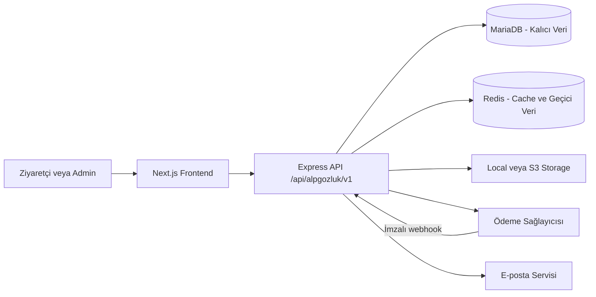

# ALP Gözlük — Mimari ve Geliştirme Yol Haritası

Bu belge projenin kalıcı mimari karar kaynağıdır. Uygulama ilerledikçe tamamlanan aşamalar ve değişen kararlar burada güncellenir.

## Temel kararlar

- Repository `frontend/`, `backend/` ve `sql/` olarak ayrılır.
- Frontend; Next.js App Router, JavaScript, Tailwind CSS, next-intl, shadcn/ui, React Hook Form ve Zod kullanır.
- Backend; Express.js, CommonJS, `mysql2/promise`, MariaDB 11.4 LTS ve Redis kullanır.
- MariaDB sipariş, ödeme, stok, fiyat, müşteri ve sepet gibi kalıcı verilerin tek doğruluk kaynağıdır.
- Redis cache, rate limit ve kısa ömürlü güvenlik verileri için kullanılır. Sipariş, ödeme, fiyat veya stok yalnızca Redis'te tutulmaz.
- Storage, `local` ve S3-compatible adaptörlerle aynı servis arayüzünü sunar. Veritabanında sağlayıcı URL'si değil storage key saklanır.
- Mevcut paylaşımlı MariaDB 10.6 yeni e-ticaret production veritabanı olarak kullanılmaz.

## Sistem akışı



## Frontend route mimarisi

```text
src/app/
├── layout.jsx
├── (site)/
│   └── [locale]/
│       ├── page.jsx
│       ├── shop/
│       ├── category/[slug]/
│       ├── collection/[slug]/
│       ├── product/[slug]/
│       ├── search/
│       ├── cart/
│       ├── checkout/
│       ├── account/
│       └── legal/[slug]/
├── (auth)/[locale]/
│   ├── login/
│   ├── register/
│   ├── forgot-password/
│   ├── reset-password/[token]/
│   └── verify-email/
└── (admin)/admin/
    ├── login/
    └── (panel)/
        ├── products/
        ├── categories/
        ├── collections/
        ├── inventory/
        ├── orders/
        ├── customers/
        ├── campaigns/
        ├── content/
        ├── media/
        ├── users/
        ├── roles/
        ├── audit-logs/
        └── settings/
```

Route group isimleri URL'ye yansımaz. Varsayılan locale Türkçedir ve URL'de prefix kullanmaz: ana sayfa `/`, müşteri girişi `/login`, mağaza `/shop` olarak açılır. Diğer diller locale prefix'i kullanır; örneğin İngilizce ana sayfa `/en`, müşteri girişi `/en/login` ve mağaza `/en/shop` olur. Eski veya gereksiz `/tr/...` adresleri prefixsiz Türkçe karşılıklarına yönlendirilir. Admin paneli `/admin` altında localesiz çalışır.

## Storage sözleşmesi

Controller ve domain servisleri yalnızca aşağıdaki storage arayüzünü kullanır:

```text
save(file, options)
delete(fileKey, options)
getUrl(fileKey, options)
```

- Development varsayılanı local storage'dır.
- Production varsayılanı S3-compatible storage'dır.
- Public medya `public/`, private medya `private/` key prefix'i kullanır.
- Public medyada CDN/public base URL; private medyada kısa ömürlü imzalı URL kullanılır.
- JPEG, PNG, WebP ve AVIF dışındaki ürün görselleri reddedilir.
- Yeni dosya ve veritabanı kaydı başarılı olmadan eski dosya silinmez.

## Redis kullanım sınırları

- Ürün, kategori, koleksiyon ve ana sayfa cache'i
- Login ve abuse-sensitive endpoint rate limit'leri
- OTP ve başarısız giriş sayaçları
- JWT denylist/session iptali
- İhtiyaç kanıtlanırsa BullMQ tabanlı arka plan işleri

İlk sürümde sepet ve favoriler Redis'te tutulmaz veya cache'lenmez. Redis çalışmazsa katalog, sepet ve favoriler MariaDB üzerinden devam eder. Cache yazma hatası kullanıcı isteğini başarısız yapmaz; güvenlik kontrollerindeki fallback ise loglanır ve sınırlı çalışır. Sepet özeti için Redis cache'i ancak ölçülmüş bir ihtiyaç oluşursa sonraki fazda değerlendirilir.

## Sepet ve favori sözleşmesi

- MariaDB; kullanıcı ve misafir sepetlerinin, hesap favorilerinin, fiyatların, stokların, indirimlerin ve kupon ilişkilerinin tek doğruluk kaynağıdır.
- Frontend yalnız `@tanstack/react-query` ile server state senkronizasyonu, optimistic update, rollback ve query invalidation yapar. Redux Toolkit, Zustand, SWR ve kalıcı Query cache kullanılmaz.
- Misafir sepeti `alp_guest_cart` adlı `HttpOnly`, `SameSite=Lax` ve production'da `Secure` cookie ile tanımlanır. Cookie'deki 256-bit rastgele token'ın yalnız SHA-256 hash'i MariaDB'de saklanır.
- Misafir favorilerinde yalnız ürün kimlikleri, en fazla 100 kayıt olacak şekilde `alp_guest_favorites_v1` anahtarıyla tarayıcıda tutulur. Fiyat, isim ve görsel localStorage'a yazılmaz.
- Giriş sonrasında misafir sepeti transaction içinde hesap sepetiyle birleştirilir. Aynı varyantların adetleri stok ve satır limitine göre sınırlandırılır; seçim durumu OR mantığıyla birleşir.
- Sepet/favori merge işlemleri idempotenttir. Başarısız merge kullanıcı girişini engellemez ve sonraki commerce isteğinde tekrar denenebilir.
- Seçimi kaldırılan sepet satırları sepet adedinde kalır; fiyat ve checkout toplamına dahil edilmez.
- Frontend fiyat, indirim, stok veya toplamı güvenilir veri olarak API'ye göndermez. Backend her mutation ve checkout öncesinde kanonik değerleri yeniden hesaplar.
- Guest checkout desteklenir; hesap açmak zorunlu değildir.

Frontend query anahtarları:

```text
['commerce', 'cart']
['commerce', 'cart', 'summary']
['commerce', 'favorites', 'ids']
['commerce', 'favorites', 'list']
```

Demo katalog artık frontend sabiti değildir. `npm run db:seed:demo-catalog` komutu ürünleri, varyantları, stokları, markaları, kategorileri, özellikleri, kuponu ve medya kayıtlarını idempotent biçimde hazırlar. Görsel dosyaları aynı storage adapter'ı üzerinden development'ta local, production'da S3-compatible depoya aktarılır. Seed tekrar çalıştırıldığında mevcut stok satış hareketleri sıfırlanmaz.

## Sipariş çekirdeği — Aşama 9A

Aşama 9A ödeme sağlayıcısından bağımsız olarak tamamlanmıştır:

- Sipariş durumu: `pending_payment → processing → shipped → delivered`; ödeme öncesi veya izin verilen operasyonlarda `cancelled`.
- Ödeme durumu: `initialized → pending → paid / failed / cancelled / expired`; başarılı ödemeden sonra `partially_refunded → refunded`.
- Gönderim durumu: `unfulfilled → preparing → shipped → delivered`; ayrıca `returned` ve `cancelled`.
- Checkout başladığında seçili varyant satırları transaction içinde kilitlenir, stok 20 dakika için ayrılır ve satılabilir `stock_quantity` aynı transaction'da azaltılır.
- Ödeme başarılı olduğunda rezervasyon `committed` olur. İptal veya süre aşımında yalnız aktif rezervasyonlar bir kez geri bırakılır ve inventory movement kaydı oluşturulur.
- İç `orders.id` API'de sipariş kimliği olarak kullanılmaz. Müşteriye `AG-YY-XXXXXXXXXX` biçiminde, belirsiz karakterleri içermeyen ve 50-bit rastgele bölüm taşıyan `order_number` gösterilir.
- Checkout isteği zorunlu `Idempotency-Key` ile tekrar gönderilebilir; aynı anahtar ikinci sipariş veya ikinci stok düşümü üretmez.
- Misafir siparişinde sepet token'ından ayrı üretilen 256-bit rastgele erişim anahtarının yalnız SHA-256 hash'i saklanır. Sipariş numarası veya sepet token'ı tek başına erişim sağlamaz.
- Ürün kodu, marka, ad, SKU, renk, ölçü, ana görsel storage bilgisi, birim fiyat, indirim, vergi, toplam, müşteri, adres, kupon ve kargo yöntemi sipariş anında snapshot olarak saklanır.
- Ödeme başarılı olduğunda yalnız siparişe dönüşen sepet satırları temizlenir; seçilmemiş satırlar korunur.
- `npm run stock:expire` süresi geçen rezervasyonları serbest bırakır. Production'da bu komut tekil çalışan cron/worker görevi olarak planlanacaktır.
- `npm run test:order-core:db` gerçek development veritabanında sepet ekle/güncelle/seç/kaldır, rezervasyon, idempotency, iptal, başarısız ödeme, stok iadesi ve ödeme kesinleştirme akışını doğrulayıp kendi kayıtlarını temizler.

## Katalog taksonomisi ve navigasyon

Katalog verisi aşağıdaki sorumluluklara ayrılır:

- `audiences` ve `product_audiences`: kadın, erkek, çocuk ve unisex hedef kitleleri
- `attribute_groups` / `attribute_values`: ürün tipi, çerçeve materyali, form, cam özelliği, renk ve ölçü filtreleri
- `categories`: kalıcı katalog hiyerarşisi
- `collections`: yaz seçkisi, dört mevsim ve benzeri editoryal/sezonluk seçkiler
- `brands`: tekrar kullanılabilir marka kayıtları
- `navigation_menus` / `navigation_items`: header mega menüsü ve lokalize bağlantıları

Kadın katalog sorgusu `women + unisex`, erkek sorgusu `men + unisex`, çocuk sorgusu yalnızca `kids` hedef kitlesini döndürür. Böylece unisex bir ürün kopyalanmadan iki katalogda görünür; ürün kimliği, slug, stok, fiyat, medya ve SEO verisi tek kayıtta kalır.

Güneş gözlüğü ve optik çerçeve ürün tipi; polarize, materyal, form, renk ve ölçü ise filtre özelliğidir. `Yeni gelenler` tarih/sıralama, `İndirim` aktif varyant fiyatı, sezon anlatıları ise koleksiyon üzerinden hesaplanır. Bu kavramlar kategori olarak çoğaltılmaz.

Public API uçları:

```text
GET /api/alpgozluk/v1/products
GET /api/alpgozluk/v1/catalog/facets
GET /api/alpgozluk/v1/navigation/header
```

Admin katalog ve navigasyon uçları authentication yanında `catalog.manage` veya `navigation.manage` permission kontrolü uygular. Header verisi Redis'te locale bazlı cache'lenir; ürün veya taksonomi değişikliğinde ilgili katalog cache prefix'i temizlenir.

Public URL yapısı:

```text
/{locale?}/shop
/{locale?}/shop/{audience}
/{locale?}/shop/{audience}/{product-type}
/{locale?}/category/{slug}
/{locale?}/collection/{slug}
/{locale?}/product/{slug}
```

Buradaki `{locale?}` Türkçe için boş, diğer diller için zorunlu prefix'tir (`/shop`, `/en/shop`).

Filtreler `material`, `shape`, `feature`, `sale`, `sort`, `page` ve `limit` query parametreleriyle taşınır. İçerik sayfaları slug tabanlı kalır; filtre kombinasyonları yeni ve kontrolsüz SEO sayfaları üretmez.

## Arama, öneri ve gerçek zamanlı iletişim kararları

OpenSearch, TensorFlow/ALS ve Socket.IO ilk production sürümünün zorunlu altyapıları değildir. Bu teknolojiler yalnızca somut ürün ihtiyacı ve ölçülmüş veri oluştuğunda devreye alınır. AlışverişKapıda projesi uygulama kodu ve kullanım örneği olarak incelenebilir; çoklu mağaza, satıcı iletişimi ve geniş katalog ihtiyaçları ALP Gözlük'e doğrudan taşınmaz.

### Arama ve OpenSearch

- İlk sürümde ürün aramasının doğruluk kaynağı MariaDB'dir. Mevcut `LIKE` tabanlı arama geçici başlangıçtır; katalog büyümeden önce güvenli sorgu normalizasyonu, uygun indeksler, sonuç sayfası, sıralama ve arama analitiği tamamlanır.
- Frontend belirli bir arama motoruna bağlanmaz. Backend'de arama sözleşmesi sabit tutulur; ileride MariaDB uygulaması OpenSearch sağlayıcısıyla değiştirilebilmelidir.
- OpenSearch; yazım hatası toleransı, Türkçe metin analizi, gelişmiş autocomplete, relevance ağırlıkları, yoğun facet kullanımı veya ölçülen arama gecikmesi MariaDB çözümünü yetersiz bıraktığında değerlendirilir.
- OpenSearch kullanılırsa MariaDB tek doğruluk kaynağı olarak kalır; arama indeksi yeniden üretilebilir bir okuma modelidir. Ürün ekleme, güncelleme ve silme senkronizasyonu; toplu reindex, sağlık kontrolü, izleme ve OpenSearch kesintisi fallback'i birlikte tasarlanmadan production'a alınmaz.

### Öneri sistemi ve davranış verisi

- TensorFlow ve ALS aynı teknoloji değildir. TensorFlow tabanlı metin/embedding çözümleri ile ALS collaborative filtering modeli ayrı ihtiyaçlar olarak değerlendirilir; AlışverişKapıda uygulaması doğrudan kopyalanmaz.
- İlk öneriler makine öğrenmesi kullanmaz. Yeni gelenler, çok satanlar, aynı marka, benzer fiyat aralığı ve gözlüğün ürün tipi, hedef kitle, çerçeve şekli, materyali, rengi ve cam özellikleri gibi yönetilen katalog verileriyle kural tabanlı öneriler üretilir.
- Kişiselleştirme için model kurmadan önce `product_view`, `search_result_click`, `add_to_cart`, `purchase` ve gerekli diğer etkileşimlerin tutarlı event sözleşmesi hazırlanır. Üyelerde kullanıcı, misafirlerde anonim oturum kimliği kullanılır; hassas veri event payload'ına yazılmaz ve saklama/izin yaklaşımı production öncesinde belirlenir.
- Event altyapısının amacı ilk aşamada veri toplamak ve ölçüm yapmaktır; ayrı recommendation veritabanı, TensorFlow, Spark veya ALS kurulmasını zorunlu kılmaz.
- ALS ancak yeterli gerçek kullanıcı-ürün etkileşimi oluştuğunda, cold-start fallback'leri belirlendiğinde ve öneri kalitesi ölçülebilir hâle geldiğinde değerlendirilir. Model yokken veya kullanıcı/ürün yeniyken kural tabanlı öneriler çalışmaya devam eder.

### Socket.IO ve gerçek zamanlı özellikler

- İlk sürümde Socket.IO/WebSocket kullanılmaz. Mevcut HTTP API ve TanStack Query akışı sipariş, iade, hesap ve admin işlemleri için yeterlidir.
- Ödeme sonucu sağlayıcı webhook'u, kargo durumu webhook veya kontrollü sorgulama, transactional e-posta ise kalıcı iş akışı üzerinden yürür. Bu kritik süreçlerin doğruluğu aktif socket bağlantısına bağlı olmaz.
- Socket.IO; canlı destek, anlık kullanıcı bildirimi, admin ekranında anlık yeni sipariş görünümü veya çevrimiçi kullanıcı takibi gibi onaylanmış bir ürün ihtiyacı oluştuğunda eklenir.
- Gerçek zamanlı olaylar yalnız bildirim/invalidation katmanıdır. Kalıcı durum MariaDB'de saklanır; istemci bir olay aldığında kanonik veriyi API'den yeniden çeker. Bağlantı kesilmesi ödeme, sipariş, stok veya iade verisi kaybına neden olmaz.
- Çoklu backend instance'ına geçilirse Socket.IO adapter, mesaj dağıtımı ve load balancer oturum yönlendirmesi production tasarımının parçası olarak ayrıca ele alınır.

## Müşteri kimlik doğrulama

- E-posta/şifre ve Google Identity Services aynı uygulama session/JWT akışını üretir.
- Tarayıcı backend JWT'sini saklamaz; Next.js BFF token'ı `httpOnly`, `sameSite` cookie olarak yönetir.
- Google ID token'ı backend'de resmi Google Auth Library ile imza, issuer, audience ve süre açısından doğrulanır.
- Google `sub` değeri provider kimliğinin kalıcı anahtarıdır; e-posta provider kimliği olarak kullanılmaz.
- Google nonce 10 dakika geçerli, tek kullanımlı ve Redis desteklidir; frontend ayrıca challenge'ı `httpOnly` cookie ile aynı tarayıcı oturumuna bağlar.
- İlk Google girişinde müşteri hesabı otomatik oluşturulur. Mevcut şifreli hesap yalnızca e-posta eşleşmesine dayanarak otomatik bağlanmaz; bu, hesap ele geçirme riskini azaltır.
- Login sheet yalnızca giriş akışlarını içerir. Kayıt formu `/{locale?}/register` sayfasında kalır.

## Yönetim kimlik doğrulama ve roller

- Public kayıt her zaman yalnız `customer` rolü üretir; yönetici kayıt sayfası bulunmaz.
- İlk ve tek korumalı `super_admin`, env bilgilerini kullanan açık bir bootstrap komutuyla oluşturulur. Mevcut müşteri hesabı otomatik yükseltilmez.
- `super_admin` uygulama üzerinden silinemez, devre dışı bırakılamaz veya rolü değiştirilemez. `super_admin` rolü başka kullanıcılara atanamaz.
- Yalnız `super_admin`, panelden `admin` ve `editor` hesapları oluşturabilir ve bu rollerin atamasını değiştirebilir. Rol/durum değişiklikleri aktif oturumları iptal eder ve audit log üretir.
- Yönetici hesapları müşteri girişinden, müşteriler de admin girişinden oturum açamaz. Google girişi yönetici hesaplarında kullanılmaz.
- Yönetim 2FA'sı RFC 6238 TOTP standardındadır ve env üzerinden açılıp kapatılır; varsayılanı kapalıdır. Açıkken Redis challenge saklama ve deneme sınırı için zorunludur.
- TOTP secret AES-256-GCM ile şifreli, kurtarma kodları hash'li tutulur. Aynı zaman adımındaki kodun tekrar kullanımı engellenir.
- Standart TOTP nedeniyle Google Authenticator yanında Microsoft Authenticator, Authy, 1Password ve Bitwarden kullanılabilir.

## Güvenlik ilkeleri

- Fiyat, indirim, kargo, stok ve sipariş toplamı backend tarafından yeniden hesaplanır.
- Para alanları `DECIMAL` kullanır.
- Stok değişiklikleri MariaDB transaction ve satır kilitleriyle korunur.
- SQL sorguları parametreli çalışır; dinamik sıralama alanları allowlist kullanır.
- Admin endpoint'leri hem authentication hem permission kontrolü uygular.
- Upload alan adı, sayı, boyut, uzantı, MIME ve dosya imzası backend'de doğrulanır.
- S3, MariaDB ve Redis secret'ları frontend'e gönderilmez.
- Ödeme webhook'ları imzalı ve idempotent işlenir; kart verisi saklanmaz.

## Uygulama aşamaları

1. [x] Repository, environment ve dokümantasyon temeli
2. [x] Express, MariaDB, Redis, health ve güvenlik altyapısı
3. [x] Next.js route groups, next-intl ve uygulama kabukları
4. [x] MariaDB başlangıç şeması, rol/izin ve audit log
5. [x] Local/S3 storage ve güvenli medya yönetimi
6. [x] Admin ürün oluşturma → DB → cache invalidation → public ürün dikey akışı
7. [ ] Katalog filtreleme, MariaDB tabanlı gerçek arama ve ayrıntılı SEO
8. [x] Müşteri adresleri, MariaDB tabanlı kalıcı sepet ve favoriler
9. [ ] Checkout, stok transaction'ı, ödeme ve webhook
   - [x] 9A — Sağlayıcıdan bağımsız sipariş çekirdeği, snapshot, idempotency ve stok rezervasyonu
   - [ ] 9B — iyzico sandbox ödeme başlatma, callback/webhook doğrulama ve başarısız ödeme akışları
   - [ ] 9C — Misafir/üyelikli checkout frontend'i ve sipariş sonuç ekranı
   - [ ] 9D — Kargo gönderisi, takip numarası ve sipariş durum senkronizasyonu
10. [ ] Admin operasyon modüllerinin CRUD akışları, staging ve production hazırlığı
11. [ ] Lansman sonrası davranış eventleri, arama ölçümleri ve kural tabanlı öneriler
12. [ ] Ölçülmüş ihtiyaca göre OpenSearch, ALS/TensorFlow ve Socket.IO değerlendirmesi

İlk altı aşamanın mimari ve çalışan iskeleti uygulanmıştır. Admin modül ekranları hazırdır; ürün oluşturma dışındaki CRUD iş akışları ilgili geliştirme aşamalarında API'lere bağlanacaktır. Şifre sıfırlama ve e-posta doğrulama ekranları mevcut olmakla birlikte e-posta sağlayıcısı seçilene kadar bilgilendirme durumundadır.

Yedinci aşamanın hedef kitle/özellik filtreleme, lokalize katalog URL'leri, yönetilebilir mega menü ve admin taksonomi CRUD bölümü uygulanmıştır. İlk gerçek arama MariaDB üzerinde tamamlanacaktır; OpenSearch bu aşamanın kabul kriteri değildir. Arama sonuç sayfası, canonical stratejisi, breadcrumb/schema çıktıları ve ileri SEO çalışmaları tamamlanmadığı için aşama henüz kapatılmamıştır.

Sekizinci aşamada misafir ve kullanıcı sepetleri, hesap ve misafir favorileri, login sonrası idempotent birleştirme, ürün seçimi, kupon, fiyat/stok uyarıları ve TanStack Query tabanlı optimistic arayüz akışları tamamlanmıştır. Sepet stok rezervasyonu yapmaz; kesin fiyat ve stok kontrolü checkout aşamasında yapılacaktır.

Dokuzuncu aşamanın 9A sipariş çekirdeği tamamlanmıştır. Bir sonraki adım 9B'de iyzico sandbox sözleşmesini mevcut `payments` denemeleri ve `commitPaidOrder` sınırına bağlamaktır. Kart verisi sisteme alınmayacak; sağlayıcı callback/webhook sonucu imza ve idempotency doğrulamasından sonra sipariş transaction'ına aktarılacaktır.

On birinci ve on ikinci aşamalar ilk production yayınının ön koşulu değildir. Bu aşamalar, gerçek kullanım verisi toplandıktan ve temel ticaret akışları kararlı hâle geldikten sonra ele alınır. İleri teknoloji kurulumu kendi başına hedef veya tamamlanma ölçütü sayılmaz; kullanıcı deneyimine ve operasyonel ihtiyaca kanıtlanabilir katkı sağlamalıdır.

## Açık dış entegrasyon kararları

Aşağıdaki sağlayıcılar seçilmeden production entegrasyonu tamamlanmış sayılmaz:

- Ödeme kuruluşu: teknik hedef iyzico sandbox; production sözleşmesi ve canlı anahtarlar bekleniyor
- Kargo kuruluşu
- Transactional e-posta servisi
- S3-compatible production storage sağlayıcısı
- Production MariaDB ve Redis barındırma ortamı

Bu kararlar seçildiğinde mevcut adapter/config sınırları üzerinden entegre edilir; controller veya frontend mimarisi yeniden yazılmaz.

## Production öncesi zorunlu kontrol listesi

Bu maddeler tamamlanmadan production yayını yapılmaz:

- [ ] **MariaDB sürümü:** MariaDB 10.6 geliştirme ortamında şimdilik kullanılabilir; production hedefimiz hâlâ ayrı MariaDB 11.4 LTS olmalı.
- [ ] MariaDB 11.4 mevcut projelerden izole bir instance/sunucuda hazırlanmalı.
- [ ] Production şeması sıralı SQL dosyalarıyla temiz ortamda kurulup doğrulanmalı.
- [ ] Otomatik yedekleme, geri yükleme ve geri dönüş senaryosu staging ortamında test edilmeli.
- [ ] Production `DB_*` değerleri yalnızca yeni MariaDB 11.4 instance'ını göstermeli; paylaşımlı MariaDB 10.6 kullanılmamalı.
- [ ] Redis servis sağlığı, kalıcılık tercihi, erişim kısıtları ve backend fallback davranışı staging'de doğrulanmalı.
- [ ] Tek kullanımlık bootstrap komutuyla korumalı `super_admin` oluşturulmalı; bootstrap e-posta ve şifresi env dosyasından hemen temizlenmeli.
- [ ] `ADMIN_2FA_ENABLED=true` yapılmadan önce ayrı development/staging doğrulaması tamamlanmalı ve `ADMIN_2FA_ENCRYPTION_KEY` güvenli secret yönetimine taşınmalı.
- [ ] Yönetim 2FA'sı açıkken Redis kesintisinin yönetici girişini güvenli biçimde kapattığı test edilmeli.
